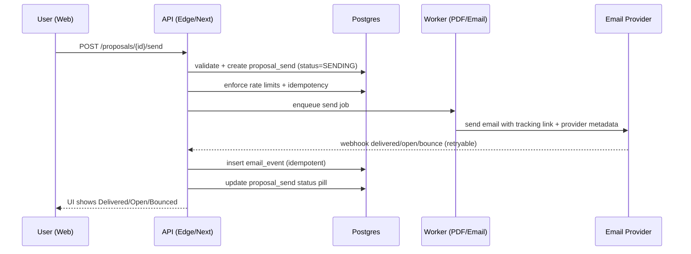
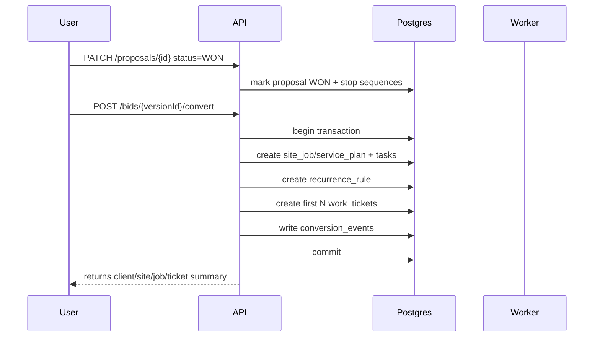
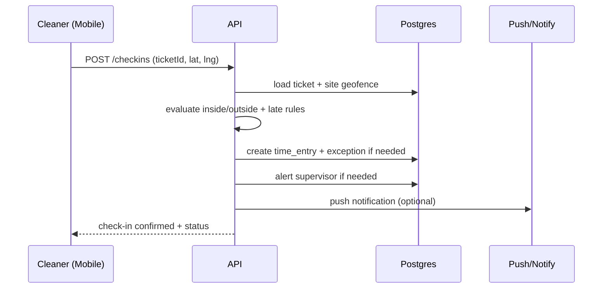
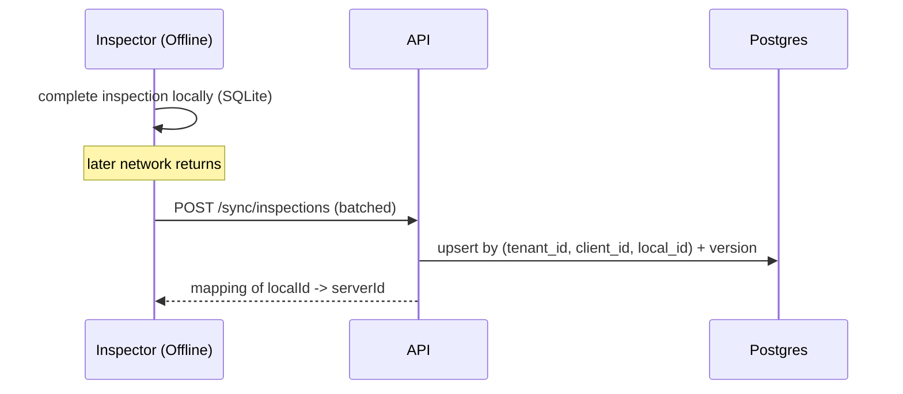

# Key workflows (sequence diagrams + rules)

These are the flows that make or break trust. If these are wrong, the rest is decoration.

## 1) Proposal send + tracking

Rules:
- Webhook ingestion must be idempotent (provider retries).
- “Open” can be noisy (privacy blockers). Treat as “engaged signal”, not absolute truth.
- Bounce should stop follow-ups by default.

## 2) Won proposal → service plan/job → tickets

Rules:
- Conversion is idempotent (cannot convert twice).
- Conversion uses transaction and emits conversion event stream.
- Support “dry run” mode: validate without committing.

## 3) Check-in/out with geofence + exceptions

Rules:
- Out-of-geofence does not block check-in by default; it creates an exception.
- Managers can approve overrides.

## 4) Offline inspection sync (never lose completed work)

Conflict rule (recommended):
- version mismatch returns `INSP_003` + server state
- client can show “Resolve” UI or retry

## 5) Asset chain gating (vehicle + keys)

- Starting ticket may require:
  - vehicle checkout (if job is route-based)
  - key custody confirmation (if key-controlled site)

Rules:
- Ticket cannot be marked “Completed” unless required key state is recorded.
- Ticket cannot be “Started” if required vehicle checkout missing (configurable by job).
