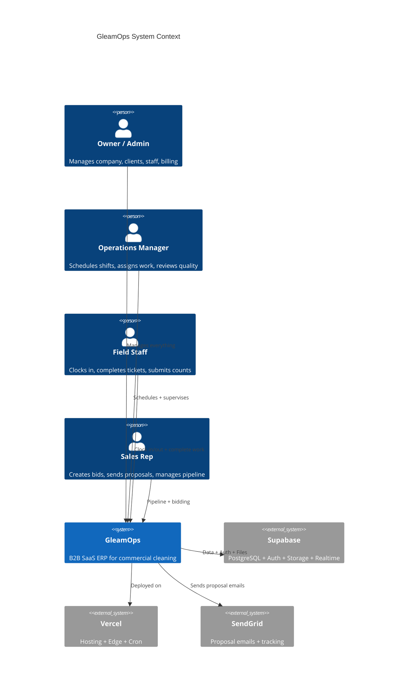
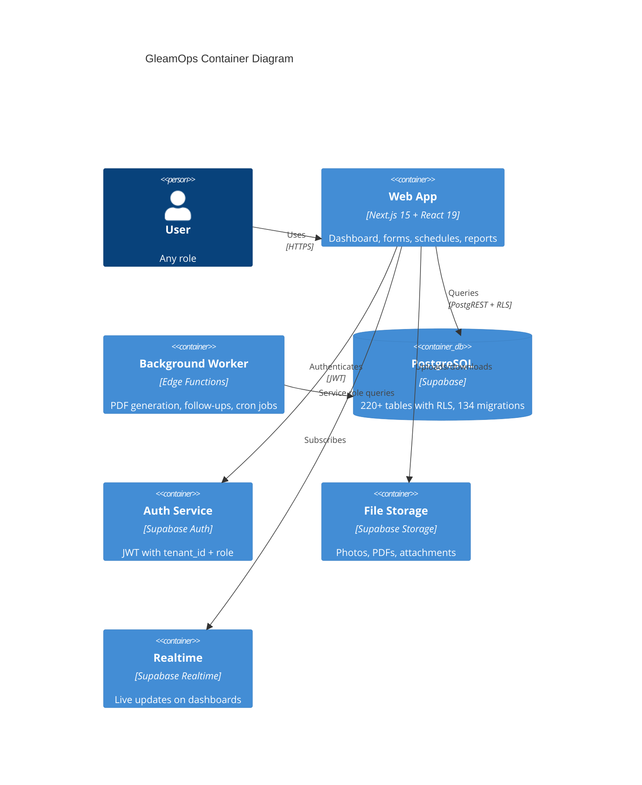
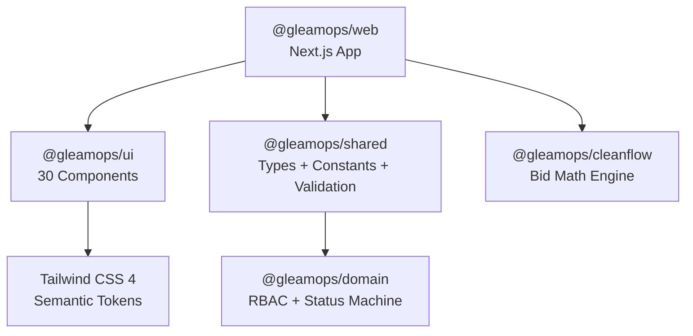
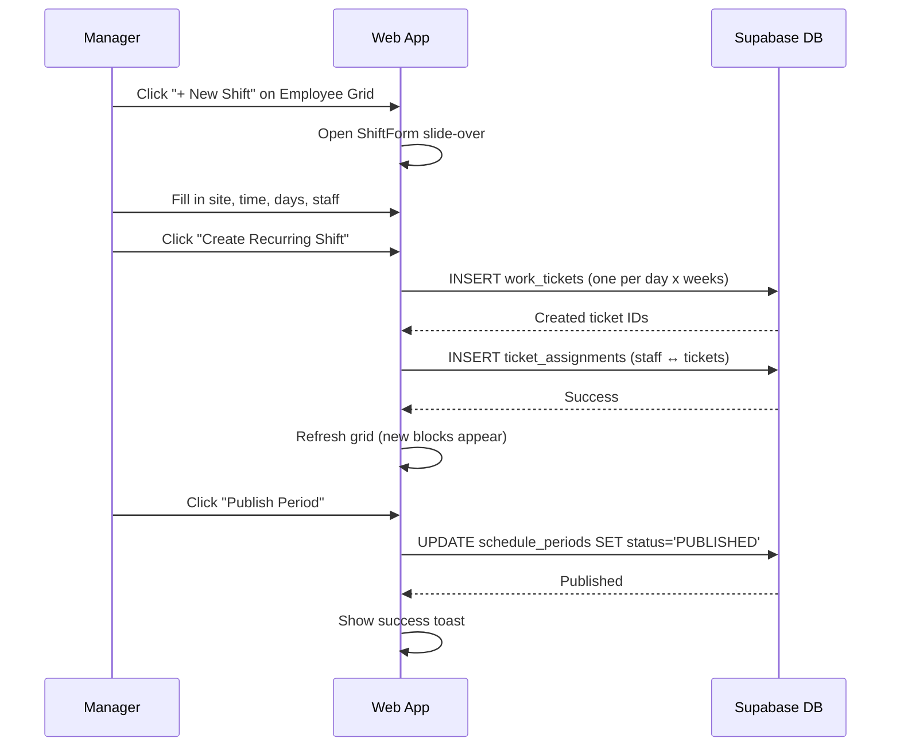
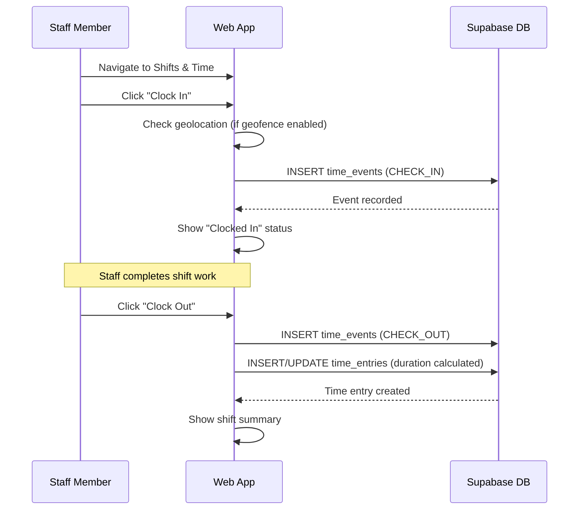

# Architecture Overview

> How GleamOps is built. Clean, visual, no jargon.

---

## System Context — Who Uses What



---

## Container View — What's Inside



---

## Technology Stack

| Layer | Technology | Purpose |
|-------|-----------|---------|
| **Framework** | Next.js 15 (App Router) | Server-side rendering, routing, API routes |
| **UI** | React 19 + TypeScript 5.7 | Component rendering |
| **Styling** | Tailwind CSS 4 | Semantic token system, dark/light mode |
| **Database** | PostgreSQL (Supabase) | 220+ tables, Row-Level Security |
| **Auth** | Supabase Auth | JWT with tenant isolation |
| **Storage** | Supabase Storage | File uploads (photos, PDFs) |
| **Realtime** | Supabase Realtime | Live dashboard updates |
| **Math Engine** | CleanFlow | Bid calculations (pure TypeScript, no DB deps) |
| **Hosting** | Vercel | Auto-deploy on git push to main |
| **Email** | SendGrid | Proposal sending + webhook tracking |
| **Monorepo** | Turborepo + pnpm | 7 packages, shared types and components |

---

## Package Structure



| Package | What It Contains |
|---------|-----------------|
| `@gleamops/web` | The app: 108 API routes, 30 detail pages, 42 forms, 23 hooks |
| `@gleamops/ui` | 30 reusable components (Badge, Button, Card, SlideOver, etc.) |
| `@gleamops/shared` | TypeScript types, Zod schemas, constants, feature flags |
| `@gleamops/domain` | Pure business rules: role checks, status transitions |
| `@gleamops/cleanflow` | Bid math: production rates, workload, pricing |
| `apps/worker` | Background jobs: PDF gen, email follow-ups |
| `apps/mobile` | Expo React Native (future) |

---

## Data Flow — How a Schedule Gets Published



---

## Data Flow — Clock In / Clock Out



---

## Security Architecture

### Multi-Tenant Isolation

Every table has a `tenant_id` column. Every query is filtered by the logged-in user's tenant.

```
User logs in → JWT contains tenant_id + role
         ↓
Every Supabase query → RLS policy checks: tenant_id = current_tenant_id()
         ↓
User can ONLY see their company's data
```

### Role-Based Access

| Role | What They Can Do |
|------|-----------------|
| OWNER_ADMIN | Everything. Full access to all modules. |
| MANAGER | Schedules, staff, clients, reports. Cannot change system settings. |
| SUPERVISOR | Shift management, team oversight, quality checks. |
| CLEANER | Clock in/out, view assigned shifts, submit counts. |
| INSPECTOR | Quality inspections, issue reporting. |
| SALES | Pipeline, bids, proposals. Cannot access HR or payroll. |

### Data Safety

- **Soft delete only.** Nothing is permanently deleted. Items are archived with `archived_at`.
- **Optimistic locking.** Every update checks `version_etag` to prevent overwrites.
- **Audit trail.** Activity history on every detail page.
- **Status enforcement.** Invalid status transitions are blocked by database triggers.

---

## Deployment

- **Git push to `main`** triggers Vercel auto-deploy.
- **Database migrations** are applied via `supabase db push`.
- **Environment variables** control feature flags (e.g., `NEXT_PUBLIC_FF_V2_NAVIGATION=enabled`).
- **Cron job** runs daily at 13:00 UTC for inventory count reminders.
