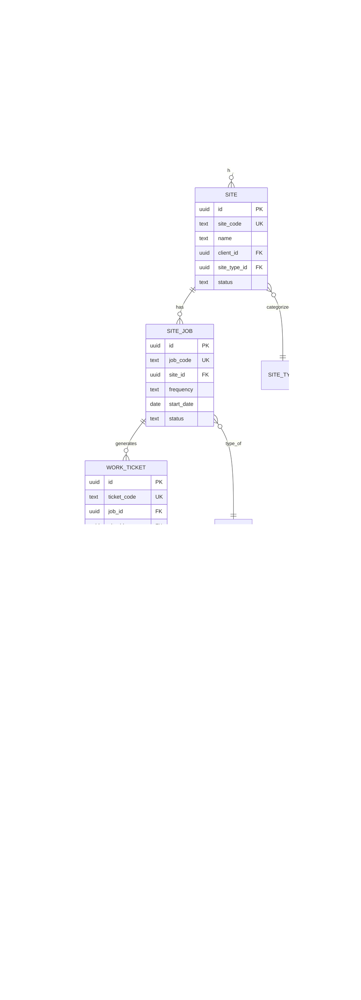

# Data Model Overview

> The key things GleamOps tracks and how they connect.

---

## Core Entities — The Big Picture



---

## How Entities Connect — Plain English

### The Client Chain
- A **Tenant** (your company) has many **Clients** (the businesses you clean for).
- Each **Client** has one or more **Sites** (physical locations).
- Each **Client** has **Contacts** (people you talk to).

### The Work Chain
- Each **Site** has one or more **Service Plans** (site_jobs) defining what cleaning work happens.
- Each Service Plan generates **Work Tickets** — one ticket per scheduled date.
- Each Work Ticket has **Ticket Assignments** linking it to **Staff** members.

### The Time Chain
- When staff **clock in** and **clock out**, a **Time Entry** is created.
- Time entries link to the ticket they worked on.
- Timesheets aggregate time entries for payroll.

### The Sales Chain
- **Prospects** become **Opportunities** become **Bids** become **Proposals**.
- A won proposal converts into a **Client** + **Site** + **Service Plan**.

---

## Entity Code Formats

Every entity has a human-readable code in addition to its UUID.

| Entity | Format | Example |
|--------|--------|---------|
| Client | `CLI-NNNN` | CLI-1001 |
| Site | `SIT-NNNN` | SIT-2050 |
| Staff | `STF-NNNN` | STF-1042 |
| Contact | `CON-NNNN` | CON-0015 |
| Service Plan | `JOB-YYYY-A` | JOB-2026-A |
| Work Ticket | `TKT-NNNN` | TKT-0847 |
| Task | `TSK-NNN` | TSK-001 |
| Service | `SER-NNNN` | SER-0001 |
| Bid | `BID-NNNNNN` | BID-000123 |
| Proposal | `PRP-NNNNNN` | PRP-000456 |
| Prospect | `PRO-NNNN` | PRO-0012 |
| Opportunity | `OPP-NNNN` | OPP-0034 |

---

## Standard Columns (Every Table)

Every business table has these columns:

| Column | Type | Purpose |
|--------|------|---------|
| `id` | UUID | Internal primary key (never shown to users) |
| `tenant_id` | UUID | Which company owns this record |
| `*_code` | TEXT | Human-readable identifier (shown in UI) |
| `created_at` | Timestamp | When the record was created |
| `updated_at` | Timestamp | When the record was last modified |
| `archived_at` | Timestamp | When it was soft-deleted (NULL = active) |
| `archived_by` | UUID | Who archived it |
| `archive_reason` | TEXT | Why it was archived |
| `version_etag` | UUID | Changes on every update (prevents conflicting edits) |

---

## Status Lifecycles

### Client Status
```
PROSPECT → ACTIVE → ON_HOLD → INACTIVE → CANCELED
                  ↑          ↓
                  └──────────┘ (reactivate)
```

### Staff Status
```
DRAFT → ACTIVE → ON_LEAVE → INACTIVE → TERMINATED
               ↑          ↓
               └──────────┘ (return from leave)
```

### Work Ticket Status
```
SCHEDULED → IN_PROGRESS → COMPLETED → VERIFIED
                        ↓
                     CANCELED
```

### Service Plan (Job) Status
```
DRAFT → ACTIVE → ON_HOLD → COMPLETED
                          → CANCELED
```

### Schedule Period Status
```
DRAFT → PUBLISHED → LOCKED
```

---

## Common Gotchas

| Situation | What's Happening | What To Do |
|-----------|-----------------|------------|
| "Open Shift" in schedule grid | A ticket exists but no staff is assigned | Assign staff via the shift form |
| Staff member not showing in grid | They have no ticket assignments for this period | Create a shift and assign them |
| Client shows "PROSPECT" status | They came from the sales pipeline, not yet converted | Convert via Pipeline > Won flow |
| Site has no service plans | The site exists but no recurring work is scheduled | Create a service plan under Jobs |
| Ticket status stuck at SCHEDULED | No one has started working it yet | Staff needs to clock in or update the ticket |

---

## Key Relationships to Remember

1. **Clients own Sites.** Archive a client → its sites get archived too.
2. **Sites own Service Plans.** Archive a site → its jobs get archived too.
3. **Service Plans generate Tickets.** One job creates many tickets over time.
4. **Tickets have Assignments.** Each ticket links to one or more staff members.
5. **Staff log Time against Tickets.** Time entries always reference a ticket.
6. **Everything has a tenant_id.** You can never see another company's data.
