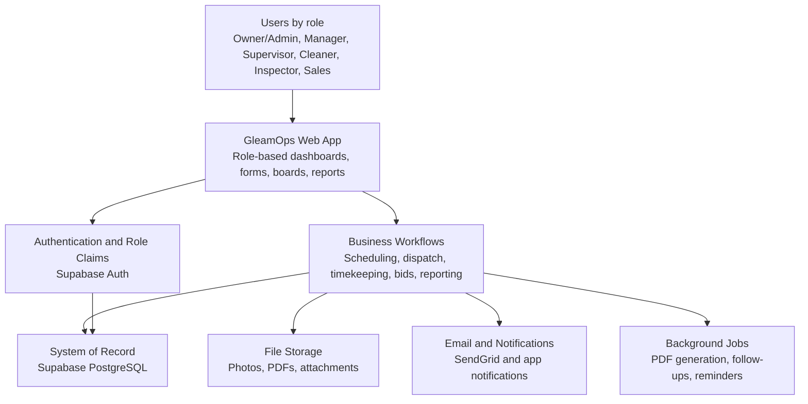
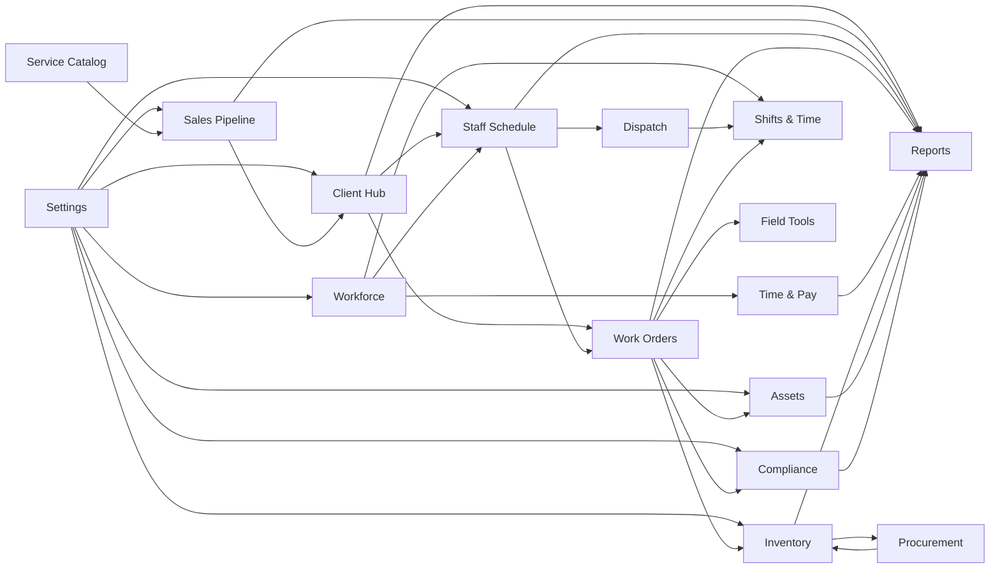
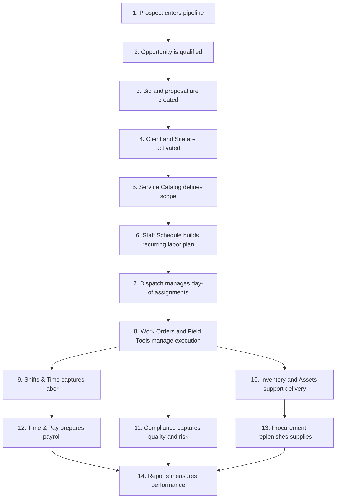

# Executive SOP: How GleamOps Works

> Executive-facing operating guide for the full app.
> Written for leaders who need to understand how the business runs through GleamOps without reading the full technical manual.

---

## What GleamOps Is

GleamOps is the operating system for a commercial cleaning company.

It connects the full business cycle in one platform:

1. Win work
2. Set up the client and site
3. Define what service will be delivered
4. Schedule the labor
5. Dispatch the work
6. Track execution in the field
7. Capture time, supplies, quality, and incidents
8. Review payroll, performance, and reporting

Instead of keeping sales, scheduling, field execution, inventory, compliance, and reporting in separate tools or spreadsheets, GleamOps connects them into one operating flow.

---

## Who This Guide Is For

Use this document if you are:

- an owner who needs to understand what the system controls
- an operations leader who needs to know where work happens
- a department lead who needs to know what data each module owns
- a new executive stakeholder who needs the "how the business runs here" version

Use the detailed manual when you need screen-by-screen instructions:

- [Instruction Manual Index](./README.md)
- [Module-by-Module Guide](./11-module-map.md)

---

## Executive Summary

At a business level, GleamOps has five jobs:

| Business function | What GleamOps does |
| --- | --- |
| Revenue generation | Tracks prospects, opportunities, bids, proposals, and sales administration |
| Service setup | Stores clients, sites, contacts, service definitions, and operational rules |
| Labor planning | Builds recurring schedules, captures availability, and manages dispatch |
| Service execution | Runs work orders, field tools, route execution, inspections, and time capture |
| Business control | Tracks workforce, inventory, assets, compliance, settings, and reporting |

If you remember one thing, remember this:

`Pipeline wins work -> Client and Site become active -> Service Catalog defines the work -> Staff Schedule plans labor -> Dispatch and Work Orders run the day -> Shifts & Time, Inventory, Assets, and Compliance capture what happened -> Reports summarizes performance`

---

## App Architecture In Business Language

GleamOps is built in four layers:

### 1. Experience Layer

This is the part users see and touch.

- Web dashboard
- role-based navigation
- forms, tables, boards, calendars, and detail pages

This is where staff, managers, sales, and leaders do their work.

### 2. Operating System Layer

This is where business workflows run.

- schedule creation
- dispatch planning
- work order execution
- payroll preparation
- bid generation
- inventory and compliance processes

This is the logic layer that turns user actions into operational outcomes.

### 3. System of Record Layer

This is the permanent memory of the business.

- clients
- sites
- contacts
- staff
- work tickets
- time entries
- inventory
- equipment
- incidents
- reports data

This is where the app stores the truth.

### 4. Automation and Delivery Layer

This handles supporting system services.

- hosting and deployment
- background jobs
- email sending
- file storage
- authentication
- reporting refreshes

This layer keeps the platform available, secure, and connected.

---

## Simple Architecture Map

---

## Brain Map: What Connects To What

---

## Core Business Flow

---

## Module Directory

Each row answers four executive questions:

- What is it?
- Who uses it?
- What data does it own?
- What are the main workflows?

| Module | What it is | Who uses it | What data it owns | Main workflows |
| --- | --- | --- | --- | --- |
| Home + Search / Command Palette | The command center and global navigation layer | All roles | KPI views, alerts, quick actions, saved navigation state | Review health of the business, jump to work, surface urgent issues |
| Staff Schedule | The recurring labor planning system | Owner/Admin, Manager, Supervisor, staff in read-only views | recurring assignments, availability, leave, period planning state | build schedules, manage leave, review employee schedules, prepare future coverage |
| Dispatch | The day-of operations control layer | Owner/Admin, Manager, Supervisor, field staff in role-based views | planning notes, board state, daily assignment context, route-level operations state | plan today's work, rebalance labor, assign route context, manage operational exceptions |
| Work Orders | The execution record for scheduled and active work | Owner/Admin, Manager, Supervisor, field users by assignment | service plans, tickets, routes, inspections, work calendars | generate and manage work, track completion, inspect quality, monitor route execution |
| Field Tools | The field support layer for frontline execution | Supervisor, Cleaner, Inspector, Manager | checklists, field requests, time alerts, field support events | complete checklists, raise requests, resolve execution issues, follow timing exceptions |
| Client Hub | The customer system of record | Owner/Admin, Manager, Sales | clients, sites, contacts, client requests | onboard clients, maintain site records, manage contacts, receive and track service requests |
| Sales Pipeline | The revenue pipeline system | Owner/Admin, Manager, Sales | prospects, opportunities, bids, proposals, funnel analytics | qualify leads, price work, send proposals, convert wins into active accounts |
| Estimating | The pricing and labor modeling engine | Sales, Owner/Admin, Manager | bid assumptions, labor calculations, supply calculations | estimate labor, calculate pricing, model service cost, support proposal creation |
| Sales Admin | The sales operations control panel | Owner/Admin, Manager, Sales | proposal templates, follow-up templates, marketing inserts, sales defaults | standardize proposals, manage follow-up automation, control sales content |
| Workforce | The people management hub | Owner/Admin, Manager, Supervisor, staff in limited views | staff profiles, positions, HR records, messages, field reports, partner records | manage staff records, maintain roles and positions, communicate with workforce, review field submissions |
| Time & Pay | The labor reconciliation and payroll review layer | Owner/Admin, Manager, payroll-facing leaders | attendance records, timesheets, payroll prep records, payout programs | review attendance, approve timesheets, prepare payroll, manage labor outputs |
| Shift Config | The shared shift rules area | Owner/Admin, Manager | break rules, shift tags, reusable shift settings | define shift behavior, standardize shift labels, control reusable scheduling rules |
| Inventory | The supply control system | Owner/Admin, Manager, Supervisor, some field users | supplies, kits, stock counts, warehouse balances, site assignments | manage stock, allocate kits, count inventory, track supply by site, monitor warehouse levels |
| Procurement | The purchasing and replenishment layer | Owner/Admin, Manager, purchasing leads | purchase orders, forecasts, vendor buying records | forecast needs, place orders, manage replenishment, control vendor purchasing flow |
| Assets | The durable asset tracking system | Owner/Admin, Manager, Supervisors by scope | equipment, assignments, keys, vehicles, maintenance records | assign gear, manage keys, track vehicles, log maintenance and repairs |
| Compliance | The quality, training, and risk layer | Owner/Admin, Manager, Supervisor, Inspector | certifications, training records, incidents, expiration tracking | track readiness, manage incidents, record training, monitor expirations, support audits |
| Reports | The analytics and executive visibility layer | Owner/Admin, Manager, selected role-based readers | derived KPIs, operational dashboards, cross-module reporting views | review performance, monitor trends, compare modules, export leadership data |
| Service Catalog | The definition of what the business sells and delivers | Owner/Admin, Manager, Sales, operations leaders | tasks, services, mappings, reusable scopes | define task library, package services, connect tasks to service offerings, standardize scope |
| Settings | The tenant-wide control panel | Owner/Admin | company profile, lookups, geofences, rules, import config, sequences, global settings | control system behavior, manage master data, define automation rules, handle imports and setup |
| Shifts & Time / Tonight Board | The live time and route execution system | Field staff, supervisors, managers | time events, active shift state, route execution state, travel and stop progress | clock in and out, record breaks, run route execution, monitor live night operations |

---

## Module Details

### Home + Search / Command Palette

**What it is**

The front door of the platform. This module does not usually own core records. It gives each role the right dashboard, alerts, and shortcuts.

**Who uses it**

- everyone

**What it owns**

- dashboard views
- KPI widgets
- alerts
- quick actions
- search and command navigation

**Main workflows**

1. Review daily health of the business
2. Spot urgent issues
3. Jump into another module

**Key connections**

- pulls from every major module
- feeds users into the right downstream workflow

### Staff Schedule

**What it is**

The planning engine for recurring labor and future coverage.

**Who uses it**

- Owner/Admin
- Manager
- Supervisor
- field staff in read-only or role-limited views

**What it owns**

- recurring schedules
- availability
- leave
- shift planning periods

**Main workflows**

1. Build the recurring schedule
2. Record staff availability and leave
3. Review what each person is scheduled to work

**Key connections**

- depends on Workforce for staff
- depends on Client Hub and Service Catalog for what work exists
- feeds Dispatch and Work Orders

### Dispatch

**What it is**

The day-of control center for translating schedule into today's operating plan.

**Who uses it**

- Owner/Admin
- Manager
- Supervisor
- field staff in route-specific views

**What it owns**

- planning notes
- board state
- route coordination context
- day-of assignment visibility

**Main workflows**

1. Review today's workload
2. adjust assignments
3. communicate route context and notes
4. manage exceptions during the day

**Key connections**

- reads from Staff Schedule
- coordinates Work Orders
- connects directly to live execution in Shifts & Time

### Work Orders

**What it is**

The operational record of service delivery.

**Who uses it**

- Owner/Admin
- Manager
- Supervisor
- assigned field staff

**What it owns**

- service plans
- work tickets
- routes
- inspections
- work calendars

**Main workflows**

1. Create and manage planned work
2. track open tickets
3. record completion status
4. inspect and verify quality

**Key connections**

- depends on Client Hub for client and site context
- depends on Service Catalog for scope
- depends on Staff Schedule for labor assignment
- feeds Field Tools, Compliance, Time capture, and Reports

### Field Tools

**What it is**

The frontline execution support system.

**Who uses it**

- Cleaner
- Inspector
- Supervisor
- Manager

**What it owns**

- checklists
- field requests
- time alerts
- frontline execution support artifacts

**Main workflows**

1. Complete checklists
2. raise issues from the field
3. respond to time-related exceptions

**Key connections**

- tied to Work Orders and Shifts & Time
- surfaces issues that managers and supervisors act on

### Client Hub

**What it is**

The commercial relationship and service-location master file.

**Who uses it**

- Owner/Admin
- Manager
- Sales

**What it owns**

- client accounts
- service sites
- contacts
- client requests

**Main workflows**

1. Set up a new client
2. add and maintain sites
3. manage contact information
4. track requests from clients

**Key connections**

- fed by Sales Pipeline conversion
- used by Schedule, Work Orders, Inventory, and Reports

### Sales Pipeline

**What it is**

The revenue generation and deal tracking system.

**Who uses it**

- Sales
- Owner/Admin
- Manager

**What it owns**

- prospects
- opportunities
- bids
- proposals
- sales analytics

**Main workflows**

1. qualify opportunities
2. build bids
3. send proposals
4. convert won work into operating records

**Key connections**

- depends on Estimating and Service Catalog
- creates downstream Client Hub and operational setup
- feeds Reports

### Estimating

**What it is**

The pricing engine that turns scope into hours, cost, and proposed price.

**Who uses it**

- Sales
- Owner/Admin
- Manager

**What it owns**

- calculation inputs
- labor assumptions
- supply assumptions
- pricing scenarios

**Main workflows**

1. estimate labor demand
2. estimate supply cost
3. support quote creation

**Key connections**

- depends on Service Catalog
- supports Sales Pipeline

### Sales Admin

**What it is**

The standardization layer for how sales materials are produced and followed up.

**Who uses it**

- Sales leaders
- Owner/Admin
- Manager

**What it owns**

- templates
- follow-up logic
- sales inserts
- sales configuration

**Main workflows**

1. control proposal presentation
2. standardize outbound communication
3. support consistent sales operations

**Key connections**

- supports Sales Pipeline
- affects proposal generation and follow-up automation

### Workforce

**What it is**

The system for managing people and organizational records.

**Who uses it**

- Owner/Admin
- Manager
- Supervisor
- staff in limited personal views

**What it owns**

- staff profiles
- positions
- HR records
- workforce messages
- field reports
- subcontractor and partner records

**Main workflows**

1. onboard and maintain staff
2. manage positions and role alignment
3. review workforce communication and field feedback
4. manage workforce compliance and employment lifecycle

**Key connections**

- feeds Staff Schedule, Dispatch, Time & Pay, Assets, and Compliance

### Time & Pay

**What it is**

The back-office labor review and payroll preparation layer.

**Who uses it**

- Owner/Admin
- Manager
- payroll-facing leaders

**What it owns**

- attendance rollups
- timesheets
- payroll review state
- payout program data

**Main workflows**

1. reconcile hours
2. review attendance
3. approve or prepare payroll data

**Key connections**

- depends on Shifts & Time and Workforce
- feeds Reports

### Shift Config

**What it is**

The reusable rules library for shift behavior.

**Who uses it**

- Owner/Admin
- Manager

**What it owns**

- break rules
- shift tags
- shift-related configuration

**Main workflows**

1. define reusable scheduling rules
2. standardize shift labeling and behavior

**Key connections**

- supports Staff Schedule and Time & Pay

### Inventory

**What it is**

The supply management system for consumable materials.

**Who uses it**

- Owner/Admin
- Manager
- Supervisor
- selected field users for counts or submissions

**What it owns**

- supply records
- kits
- stock counts
- site assignments
- warehouse balances

**Main workflows**

1. maintain supply catalog
2. allocate supplies to sites
3. count and reconcile stock
4. manage warehouse visibility

**Key connections**

- supports Work Orders and field execution
- connects to Procurement
- feeds Reports

### Procurement

**What it is**

The replenishment and purchasing arm of inventory.

**Who uses it**

- Owner/Admin
- Manager
- purchasing leads

**What it owns**

- purchase orders
- supply forecasts
- vendor purchase activity

**Main workflows**

1. forecast buying needs
2. issue purchase orders
3. manage replenishment cycle

**Key connections**

- depends on Inventory demand signals
- depends on vendor records
- feeds Inventory availability and Reports

### Assets

**What it is**

The tracking system for durable property and access items.

**Who uses it**

- Owner/Admin
- Manager
- Supervisor in scoped workflows

**What it owns**

- equipment
- assignments
- keys
- vehicles
- maintenance records

**Main workflows**

1. assign tools and access items
2. track where assets are
3. maintain service history
4. manage fleet visibility

**Key connections**

- supports Work Orders and field execution
- feeds Compliance and Reports

### Compliance

**What it is**

The quality and risk management layer.

**Who uses it**

- Owner/Admin
- Manager
- Supervisor
- Inspector

**What it owns**

- certifications
- training records
- incidents
- expiration tracking

**Main workflows**

1. manage required certifications and training
2. record incidents
3. monitor upcoming expirations
4. support readiness and auditability

**Key connections**

- connected to Workforce, Assets, and Work Orders
- feeds Reports and leadership oversight

### Reports

**What it is**

The leadership visibility and analytics layer.

**Who uses it**

- Owner/Admin
- Manager
- selected role-based readers

**What it owns**

- derived metrics
- dashboard views
- exports
- cross-module reporting logic

**Main workflows**

1. review business performance
2. monitor trends
3. compare operational health across modules
4. export data for leadership decisions

**Key connections**

- consumes data from nearly every other module
- does not usually originate core operational records

### Service Catalog

**What it is**

The standard definition of what work the company sells and performs.

**Who uses it**

- Owner/Admin
- Manager
- Sales
- operations leaders

**What it owns**

- tasks
- services
- task mappings
- scope templates

**Main workflows**

1. define service building blocks
2. standardize service offerings
3. connect scope to sales and operations

**Key connections**

- supports Estimating, Sales Pipeline, Staff Schedule, and Work Orders

### Settings

**What it is**

The master control panel for company-wide configuration.

**Who uses it**

- Owner/Admin

**What it owns**

- company profile
- lookup values
- geofences
- rules
- import controls
- sequences
- global app settings

**Main workflows**

1. configure the tenant
2. control master data
3. manage system-wide behavior
4. support implementation and governance

**Key connections**

- affects nearly every module
- should be treated as a controlled admin area

### Shifts & Time / Tonight Board

**What it is**

The live execution and labor-capture system.

**Who uses it**

- Cleaner
- Inspector
- Supervisor
- Manager

**What it owns**

- clock events
- active shift state
- route execution state
- travel and stop progress

**Main workflows**

1. clock in and out
2. record breaks
3. manage active route execution
4. support live tonight operations

**Key connections**

- depends on Staff Schedule and Dispatch
- feeds Time & Pay, Work Orders, and Reports

---

## Ownership Map: Who Usually Lives Where

| Business team | Primary modules |
| --- | --- |
| Executive leadership | Home, Reports, Settings |
| Sales | Sales Pipeline, Estimating, Sales Admin, Client Hub |
| Operations management | Staff Schedule, Dispatch, Work Orders, Field Tools, Client Hub |
| Field leadership | Dispatch, Work Orders, Field Tools, Shifts & Time, Compliance |
| HR and people operations | Workforce, Time & Pay, Compliance |
| Procurement and warehouse | Inventory, Procurement, Vendors |
| Fleet and facilities support | Assets, Compliance |

---

## Data Ownership Rules Of Thumb

Use these rules when deciding where something belongs:

| If the record answers this question... | It probably belongs in... |
| --- | --- |
| Who is the customer and where is the work happening? | Client Hub |
| What exactly do we sell and perform? | Service Catalog |
| What opportunity are we trying to win? | Sales Pipeline |
| What should labor look like next week or next month? | Staff Schedule |
| What does today's operating plan look like? | Dispatch |
| What work has to be done or was done? | Work Orders |
| What happened live in the field right now? | Shifts & Time or Field Tools |
| Who worked here and what do we owe them? | Workforce and Time & Pay |
| What supplies do we have and what do we need to buy? | Inventory and Procurement |
| What assets and access items are in service? | Assets |
| Are we compliant, trained, and audit-ready? | Compliance |
| How is the business performing? | Reports |
| How does the whole system behave? | Settings |

---

## High-Value Cross-Module Dependencies

These are the handoffs executives should understand:

### Sales to Operations

- Sales Pipeline wins work
- Client Hub stores the client and site
- Service Catalog defines the service
- Staff Schedule turns it into planned labor

### Planning to Execution

- Staff Schedule sets recurring labor
- Dispatch adjusts the day
- Work Orders define the actual work record
- Shifts & Time captures live labor execution

### Execution to Control

- Field Tools, Compliance, Inventory, and Assets capture what happened during service delivery
- Time & Pay prepares labor review
- Reports turns all of it into management visibility

### Settings to Everything

- Settings changes can alter behavior across multiple modules
- treat configuration changes as executive-control actions, not casual edits

---

## Executive Control Points

These are the places leaders should monitor most closely:

| Control point | Why it matters | Main modules |
| --- | --- | --- |
| Pipeline conversion | Revenue only matters when won work becomes operational reality | Sales Pipeline, Client Hub |
| Schedule quality | Bad planning creates labor gaps, service misses, and payroll noise | Staff Schedule, Dispatch |
| Execution quality | This is where service reputation is won or lost | Work Orders, Field Tools, Compliance |
| Labor accuracy | Payroll and margin depend on clean time capture | Shifts & Time, Time & Pay |
| Supply and asset readiness | Delivery fails when teams lack tools or materials | Inventory, Procurement, Assets |
| Compliance readiness | Risk compounds quickly without active oversight | Compliance, Workforce |
| Reporting integrity | Leadership decisions depend on clean upstream process data | Reports |

---

## What To Read Next

If you want:

- the detailed screen-by-screen manual: [Instruction Manual Index](./README.md)
- the one-file module crosswalk: [Module-by-Module Guide](./11-module-map.md)
- the slide-ready leadership narrative: [Board-Deck Summary](./13-board-deck-summary.md)
- the functional ownership view: [Department-by-Department SOP](./14-department-sop.md)
- the frontline leadership training guide: [Manager and Supervisor Training Handbook](./15-manager-supervisor-training.md)
- the technical system view: [Architecture Overview](./03-architecture-overview.md)
- the entity relationship view: [Data Model Overview](./04-data-model-overview.md)
- the role access model: [Roles & Permissions](./02-roles-permissions.md)
