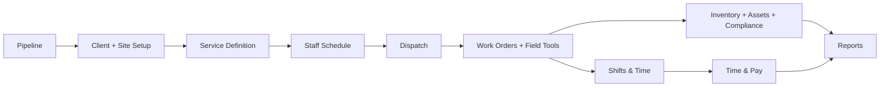

# Board-Deck Summary: GleamOps In 15 Slides

> Use this document as the source text for leadership decks, board updates, investor briefings, or executive reviews.
> Each section is written like a slide: headline first, then the talking points.

---

## Slide 1: What GleamOps Is

**GleamOps is the operating system for a commercial cleaning company.**

- It connects sales, client setup, scheduling, dispatch, field execution, payroll inputs, compliance, inventory, and reporting.
- It replaces fragmented spreadsheets and disconnected systems with one operating flow.
- It is designed for multi-role usage: leadership, sales, operations, supervisors, and field staff.

---

## Slide 2: The Business Problem It Solves

**Commercial cleaning operations break when information is scattered.**

- Sales wins work, but operations does not always receive clean setup data.
- Schedules drift away from real field conditions.
- Time capture, inventory usage, and compliance events are often recorded in separate places.
- Leadership sees lagging results instead of live operational truth.

**GleamOps solves this by making every major operating step part of one connected system.**

---

## Slide 3: The End-to-End Business Flow

**The platform mirrors the real operating model of the business.**

Talking points:

- Revenue becomes operational work through a controlled handoff.
- Planning becomes execution through schedule and dispatch.
- Execution becomes management visibility through reporting.

---

## Slide 4: How The App Is Organized

**GleamOps has four operating layers.**

| Layer | What it does |
| --- | --- |
| Experience layer | dashboards, boards, forms, detail pages, and role-based navigation |
| Workflow layer | sales, scheduling, dispatch, work order, payroll, and inventory processes |
| System-of-record layer | stores clients, sites, staff, tickets, time, supplies, assets, and compliance records |
| Automation layer | authentication, storage, email, deployments, and background jobs |

Leadership takeaway:

- Users experience a simple web app.
- Underneath it, the system controls a connected operational workflow.

---

## Slide 5: Module Families

**The platform is easiest to understand in five module families.**

| Family | Modules |
| --- | --- |
| Revenue and setup | Sales Pipeline, Estimating, Sales Admin, Client Hub, Service Catalog |
| Planning | Staff Schedule, Dispatch |
| Execution | Work Orders, Field Tools, Shifts & Time |
| Control functions | Workforce, Time & Pay, Inventory, Procurement, Assets, Compliance |
| Leadership visibility | Home, Reports, Settings |

Talking point:

- This is not just a collection of screens. It is a layered operating model.

---

## Slide 6: What Leadership Should Care About Most

**Six control points determine whether the platform is driving the business well.**

1. Pipeline conversion quality
2. Client/site setup quality
3. Schedule and dispatch quality
4. Field execution quality
5. Labor accuracy
6. Reporting integrity

If these six are healthy, the company runs with fewer surprises.

---

## Slide 7: Revenue Engine

**Revenue starts in Sales Pipeline and becomes live work through controlled conversion.**

Modules involved:

- Sales Pipeline
- Estimating
- Sales Admin
- Client Hub
- Service Catalog

Leadership value:

- better pricing discipline
- cleaner handoff from sales to operations
- less rework after work is won

---

## Slide 8: Operations Engine

**Operations is driven by planning first, then execution control.**

Modules involved:

- Staff Schedule
- Dispatch
- Work Orders
- Field Tools
- Shifts & Time

Leadership value:

- fewer coverage gaps
- clearer daily control
- better visibility into what is happening in the field right now

---

## Slide 9: Control and Risk Engine

**Support functions are built into operations instead of sitting outside it.**

Modules involved:

- Workforce
- Time & Pay
- Inventory
- Procurement
- Assets
- Compliance

Leadership value:

- labor records are tied to work
- inventory supports service delivery
- compliance and incident records stay connected to operations

---

## Slide 10: Reporting Engine

**Reports is where the business becomes measurable.**

- Reports aggregates data from nearly every major module.
- Home provides the role-based operating view.
- Reports provides the leadership and management view.
- Reporting quality depends on upstream process discipline.

Leadership takeaway:

- bad process creates bad reporting
- good reporting is a sign of healthy cross-module discipline

---

## Slide 11: Users and Roles

**The system is role-based by design.**

| Role | Primary focus |
| --- | --- |
| Owner/Admin | governance, oversight, configuration, full control |
| Manager | scheduling, operations, team coordination, reporting |
| Supervisor | day-of oversight, execution, field control |
| Cleaner | assigned work, checklists, time capture |
| Inspector | quality checks, issue reporting, field verification |
| Sales | pipeline, bids, proposals |

Leadership takeaway:

- the same system serves different operating levels without exposing everyone to every control.

---

## Slide 12: What Data The Business Actually Owns Here

**GleamOps becomes the system of record for the operating business.**

Core data domains:

- customers: clients, sites, contacts
- revenue: prospects, opportunities, bids, proposals
- labor: staff, schedules, shifts, time, payroll inputs
- service delivery: service plans, tickets, routes, inspections, field requests
- support operations: supplies, purchase orders, equipment, keys, vehicles
- control and risk: training, certifications, incidents, expirations
- management visibility: KPIs, dashboards, exports

---

## Slide 13: Executive Risk Map

**When something goes wrong, it usually fails at one of these handoffs.**

| Handoff | Typical failure | Result |
| --- | --- | --- |
| Pipeline -> Client setup | won work not converted cleanly | operations starts with incomplete information |
| Client setup -> Schedule | service/site setup is unclear | labor is planned against bad assumptions |
| Schedule -> Dispatch | recurring plan does not match day-of reality | manager intervention rises |
| Dispatch -> Field execution | route context is incomplete | field confusion and service inconsistency |
| Field execution -> Time & Pay | time is not captured cleanly | payroll review becomes noisy |
| Operations -> Reports | upstream records are weak | leadership loses trust in metrics |

---

## Slide 14: Why This Matters Operationally

**The value of GleamOps is not just software efficiency. It is operating coherence.**

- Sales and operations share the same truth
- field actions connect to management records
- payroll and reporting are tied to real work
- compliance is embedded instead of bolted on
- leadership can manage from connected information instead of fragmented updates

---

## Slide 15: The Executive Readout

**If GleamOps is working well, leadership should be able to answer these questions quickly:**

1. What work did we win?
2. What work is scheduled?
3. What work is being performed today?
4. Who is working, and are hours accurate?
5. Do teams have the tools and supplies they need?
6. Are we compliant and audit-ready?
7. What is the business performance trend?

If the system can answer those seven questions cleanly, it is doing its job.

---

## Appendix: Best Source Files For Deeper Reading

- [Executive SOP](./12-executive-sop.md)
- [Module-by-Module Guide](./11-module-map.md)
- [Architecture Overview](./03-architecture-overview.md)
- [Data Model Overview](./04-data-model-overview.md)
- [Roles & Permissions](./02-roles-permissions.md)
